# Markdown-parse Testing
## Markdown-parse Repositories
1. [My Markdown](https://github.com/jrbryant55/markdown-parser)
2. [Reviewed Markdown](https://github.com/bchoUCSD/markdown-parser)
---
# Snippet 1
Expected: 

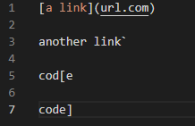

Test code:

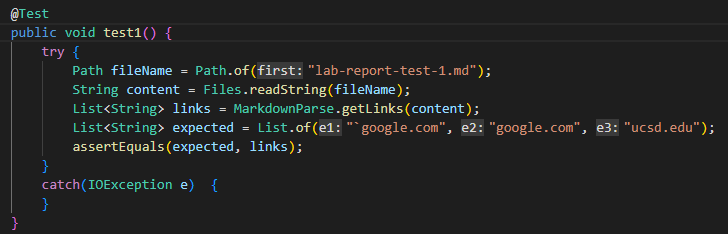

Output for Review (Fail):

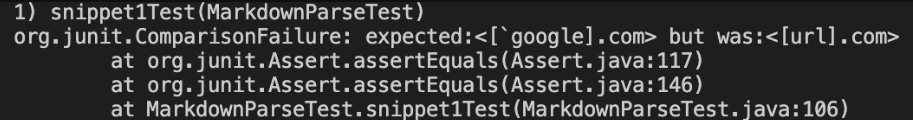

Output for Mine (Fail):

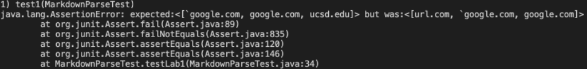

Coding Analysis:
There is a small coding change I could make and that would be to look for the implementaion of backticks (`). Adding an if statement to the loop to look for backticks would solve my code. This would solve my code because at the moment it does not look for any unnecessary characters.

---
# Snippet 2
Expected: 

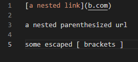

Test code:

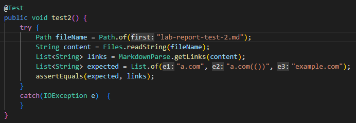

Output for Review (Fail):

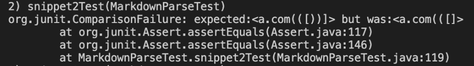

Output for Mine (Fail):

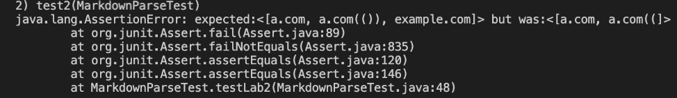

Coding Analysis:
There is a small coding change I could make and that would be to find the last closing parenthesis and/or bracket. I would need to find these to fix the code, or I could use `indexof` to find it.

---
# Snippet 3
Expected: 

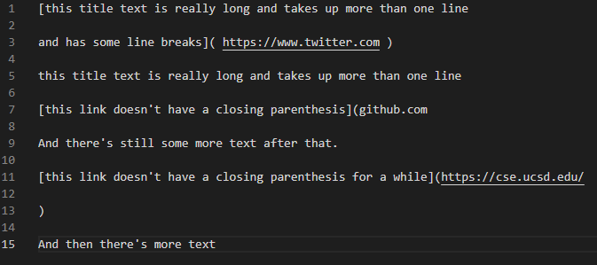

Test code:

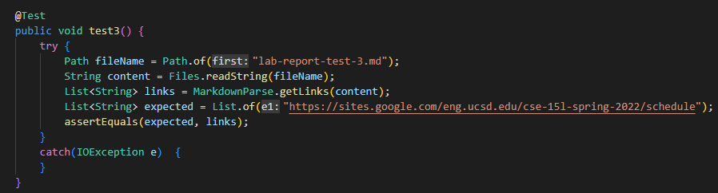

Output for Review (Fail):

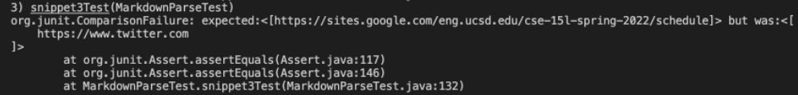

Output for Mine (Fail):

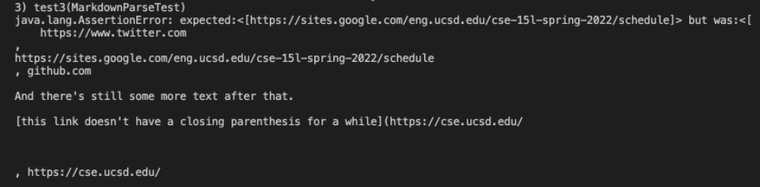

Coding Analysis:

This fix would not be within 10 lines because I would need to fix how my code finds lines in accordance to the parenthesis and brackets. I would need to look for the existance of brackets or parenthesis for every line, and if they aren't there, then I would need to code that accordingly.
