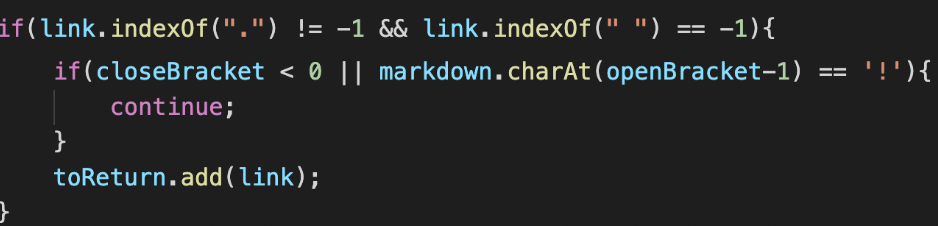

# Lab 5
I found these files by using `vimdiff` to look at the various results from my version of the code and the provided version.

## Test file 473
[Link to Test File 473](https://github.com/nidhidhamnani/markdown-parser/blob/main/test-files/473.md)

### `vimdiff` output: 

### VSCode Preview of 473:

- Since `bar` is highlighted blue in the preview of file 473, that means that clicking on it will direct the user to a link. This link leads to wherever `/url` is directed to go. That means that the provided markdown-parse is correct in the expected output of `[/url]`.

- The issue with my program would be that it does not return a link if there is no period in the text. Here is an screenshot of my code.

- If a period is not found in the test file, then my code will assume that the text witin the parenthesis is not a link. This was added because of the common `.com` or `.org` that is at the end of websites. The fix to this problem would be to remove the first `if` statement shown in the code.

---

## Test file 421
[Link to Test File 421](https://github.com/nidhidhamnani/markdown-parser/blob/main/test-files/421.md)

### `vimdiff` output: 

### VSCode Preview of 473:

- Since `bar` is highlighted blue in the preview of file 473, that means that clicking on it will direct the user to a link. This link leads to wherever `/url` is directed to go. That means that the provided markdown-parse is correct in the expected output of `[/url]` (Same as previous case).

- The problem is the same as in the case of Test File 421. My code does not return the link if there is no period present. Look at Test File 473 for the explanation.

