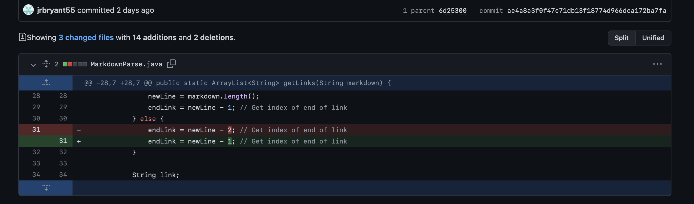

# Lab Report 2
---
* # Code Change 1:

* ## Link to test file: 
[Link](https://github.com/jrbryant55/markdown-parser/commit/1880ed49bc1b08898199f22de9caa45688633864) (top test file)
* ## The symptom of the failure inducing input: 

* ## Relationship:
* * The relationship between the bug and the failure-inducing input is that the code cannot read the extra pair of parentheses. This is shown in the symptom because of the OutOfMemoryError. The code only reads the first parenthesis it sees, and the next ending parentheses, so having multiple in the link will cause said error.
---
* # Code Change 2:

* ## Link to test file that failed: 
[Link](https://github.com/jrbryant55/markdown-parser/commit/ae4a8a3f0f47c71db13f18774d966dca172ba7fa) (bottom test file)
* ## The symptom of the failure inducing input: 

* ## Relationship:
* * The bug was the code was deleting one more space at the end of the link than it was supposed to, which led to the output reading “https://something.co” instead of “https://something.com.” However, this was not the case with the html link due to that link being [Link1] and not [Link2]. Therefore, the fix to the bug was to change the amount subtracted from the link in the MarkdownParse.java file.
---
* # Code Change 3:

* ## Link to test file that failed: 
[Link](https://github.com/jrbryant55/markdown-parser/commit/038be8706c91573522e6d7ab6ad6fcf14d7febaa) (bottom file)
* ## The symptom of the failure inducing input: 

* ## Relationship:
* * The relationship between the bug and the failure-inducing input is that the previous code could not recognize a lone “[ ]” line, which would cause the symptom to be a StringIndexOutOfBoundsException. The symptom showcases that the code can not read the brackets because it is out of bounds. The new codes fixes this by removing the endLink = newLine -1.
