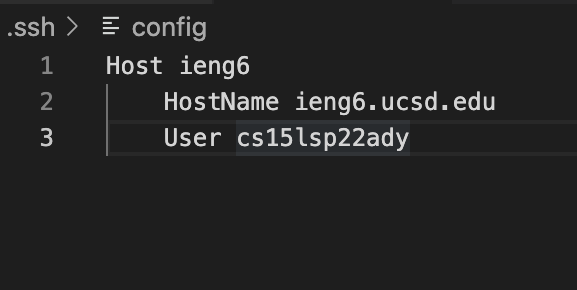
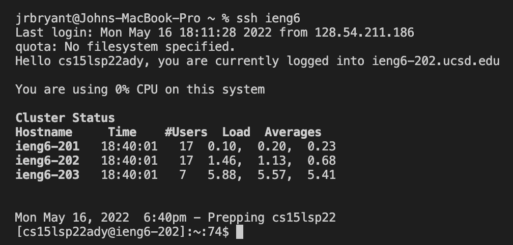
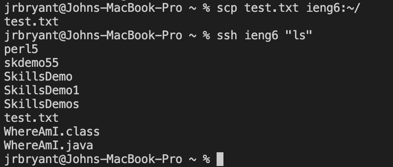
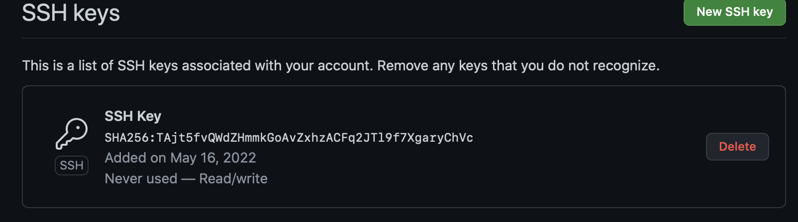
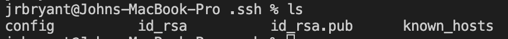
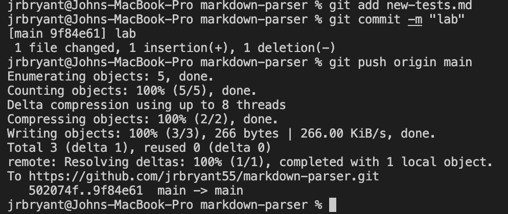
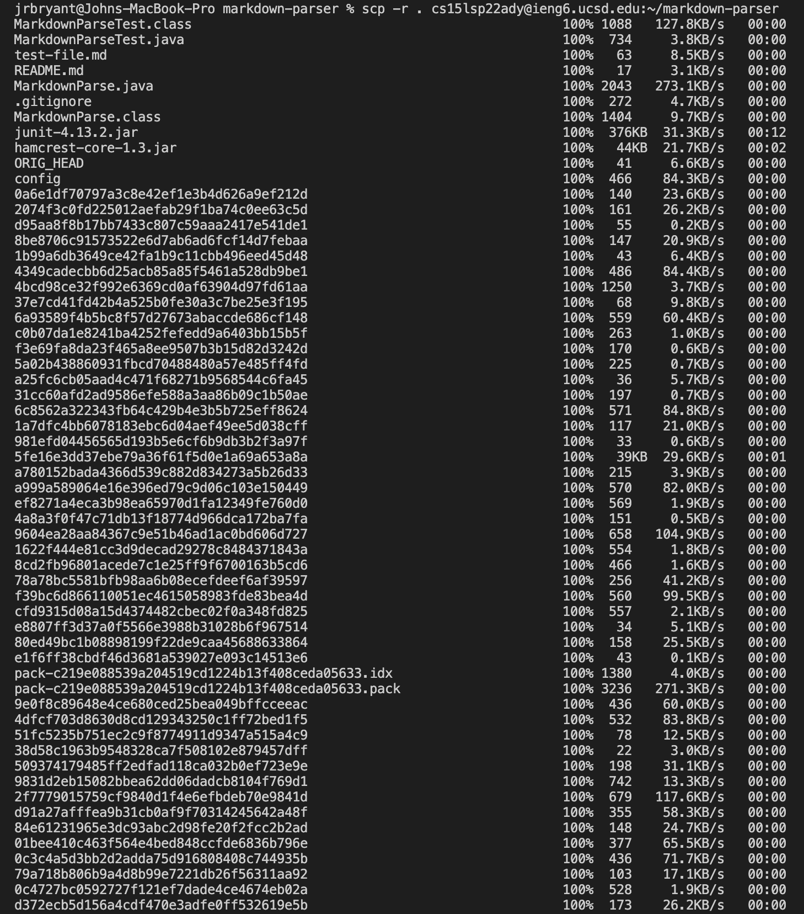
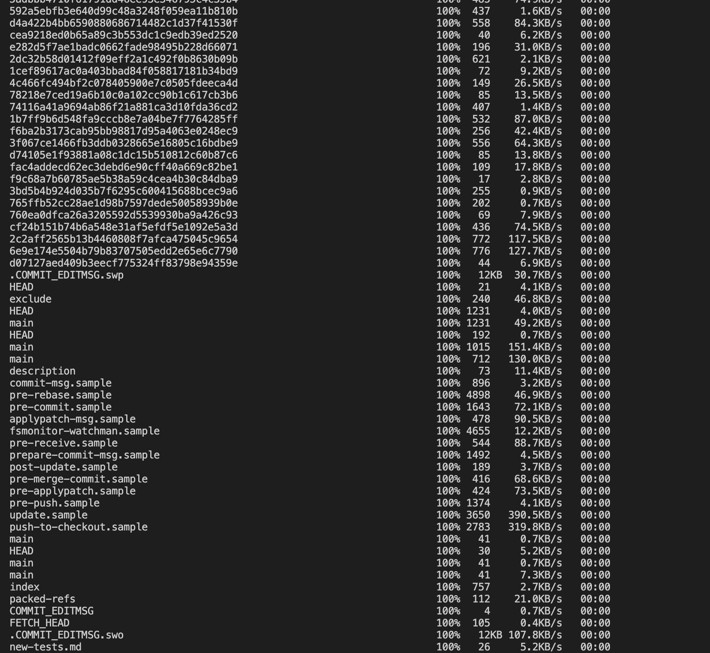
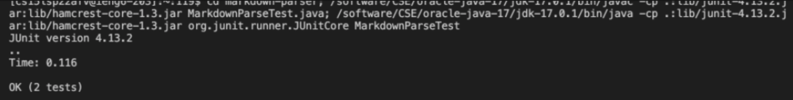
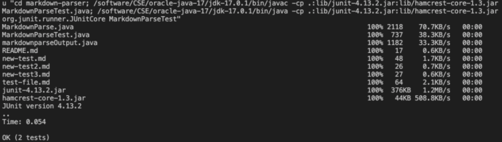

# Streamline SSH Configuration
I had to create a config file for the login to continue withe the configuration.

Afterthat, I went onto log onto the remote server using the code `ssh ieng6`.

With the new login, I was allowed to use commands without typing all of the User info, and here is an example:

---
# Setup Github Access from ieng6
I first started off by copying my key to Github, and here is a screenshot of the copy:

Here is also a picture of where the private key is held:

After these preparations, I was able to commit from the config rather than from GitHub desktop, as shown here:

I know this commit went through because of the commit history shown here [history](https://github.com/nidhidhamnani/markdown-parser/compare/main...jrbryant55:main)
---
# Copy whole directories with scp -r
First, I just used the command `scp -r cs15lsp22ady@ieng6.edu:~/markdown-parser` to copy the directory.

After copying, I was able to run JUnit tests with the javac, java commands

I was able to run both tests by combining `scp` and `ssh`.
